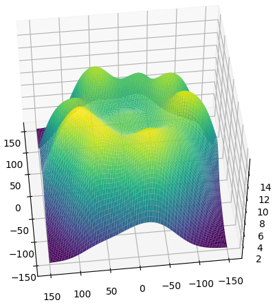
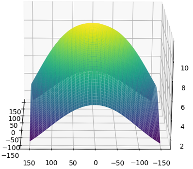
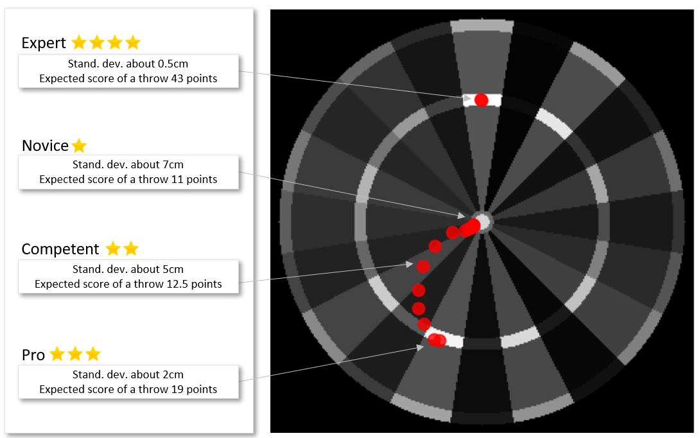

# Calculation of expected score distribution in Darts game

The question to answer
* What is the point on the dartboard with the highest expected score given standard deviation of throws (other words what is the aim point for a novice/advanced/expert player on a dartboard?)

### The distribution of scores varies depending on the standard deviation of throwsx

The sample distribution of scores given 1 cm standard deviation of throws

... and standard deviation of throws 2 cm

... and standard deviation of throws 6 cm

As a result, the target point of dartboard with maximum expected score depends on the standard deviation of the throws

The tensorflow convolutional function was used to sum up expected values of throws for the every point of a graph.

All the graphs below are generated using the code in the repository. 
There are no simulations/MonteCarlo etc, this is an analytic computation based on formulas

### Requirements
>Python 3.9.13,
>Numpy 1.22.4,
>Tensorflow 2.11.0,
>Scipy 1.8.1,
>Matplotlib 3.7.1
