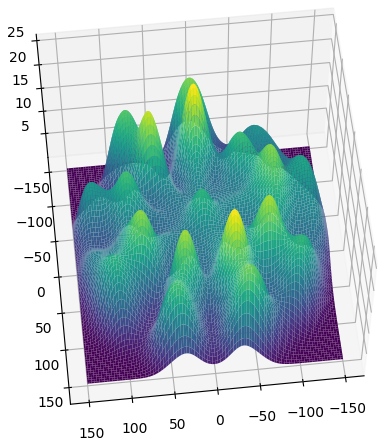

# Calculation of expected score distribution in Darts game

The question to answer
* What is the point with the highest expected score on the dartboard given standard deviation of throws

### The distribution of scores varies depending on the standard deviation of throws

The sample distribution of scores given 1 cm standard deviation of throws

